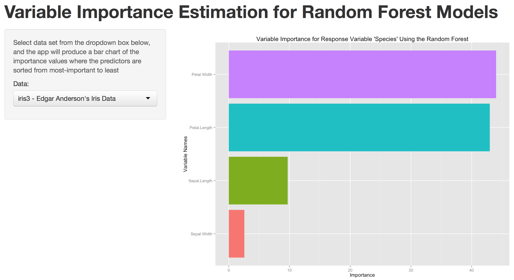

<style>
em {
  font-style: italic
}
strong {
  font-weight: bold;
}
</style>

## Introduction
** **
<br>
**What are Random forests?**
<br>
* Random forests are a type of `recursive partitioning` method particularly well-suited to small n large p problems (Strobl et al. 2009b: 339).
* It is one of the best "black-box" `supervised learning` methods. 
* They involve an ensemble (aka: set) of classification (or regression) trees that are calculated on random subsets of the data, using a subset of randomly restricted and selected predictors for each split in each classification tree (Strobl et al. 2008: §2; Strobl et al. 2009b; a.o.).
* are used not only for prediction, but also to `assess variable importance`

--- .class #id 

## Measuring Variable Importance
** **
<p> </p>

**Gini importance**

With Random Forests, the `Gini importance index` is defined as the averaged Gini decrease in node impurities over all trees in the forest (it follows from the fact that the Gini impurity index for a given parent node is larger than the value of that measure for its two daughter nodes. Also helping in the interpretation is that they can output a list of predictor variables that they believe to be important in predicting the outcome. 

---  .class #id 

## Variable Importance Assessing App
** **
To help you understand the order of variable importance for a given dataset, we have developed an easy to use web application by leveraging the `caret` package in R. This package uses by defualt the Gini importance. The variable importance can be calculated by using the `varImp` function in the caret package. 

Go to the [app website](http://) and select one of the three pre-loaded data sets, and the application will display a bar chart (uses `ggplot2` package) demonstrating the ordered variable importance of the selected data set. 

&nbsp;&nbsp;&nbsp;&nbsp;&nbsp;&nbsp;&nbsp;&nbsp;&nbsp;&nbsp;&nbsp;&nbsp;&nbsp;&nbsp;&nbsp;&nbsp;&nbsp;&nbsp;&nbsp;&nbsp;&nbsp;&nbsp;&nbsp;&nbsp;&nbsp;&nbsp;&nbsp;&nbsp;&nbsp;&nbsp;&nbsp;&nbsp;


---   .class #id 


## Server Side Calculation
** **
With random forest, the `Variable Importance` is calculated via the R code below on the server side:
```{r echo = F}
pkgs <- c("randomForest","caret","datasets")
pkgs <- pkgs[!(pkgs %in% installed.packages()[,"Package"])]
if(length(pkgs)) install.packages(pkgs,repos="http://cran.cs.wwu.edu/")
library(randomForest); library(ElemStatLearn); library(caret);library(datasets)
```  

```{r }
data(iris3); iris$Species <- as.factor(iris$Species)
rf<-randomForest(Species~.,data=iris)
vi<-varImp(rf)
vi$names <- row.names(vi)
rf1<-vi[order(-vi$Overall),]; rf1
```